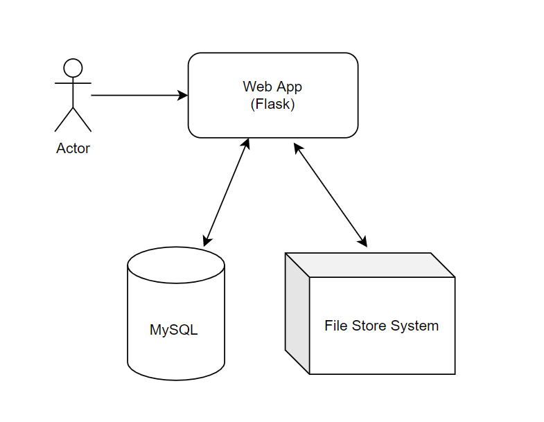

# Shopify Developer Intern Challenge 2021

## About

This is my submission for the [2021 Shopify Developer Intern Challenge](https://docs.google.com/document/d/1ZKRywXQLZWOqVOHC4JkF3LqdpO3Llpfk_CkZPR8bjak/edit#heading=h.n7bww7g70ipk). In this challenge I created an image repository where you users can store and showcase images. Every user needs to register in order to post images. Users also have the option to set visibility an image to be public or private. Visibility can be changed whenever they like. Only public images are visible to everyone. Users can also delete an image (pertaining to their account only) as well as modifying the file name of the image. Only image files(jpeg,png,jpg) are accepted with a max file size of 5MB.

## Architecture and Design 

*Figure 1: Design of Image Repository*

Based on the image above, the design consists of a webapp which the user interacts with. The webapp then communicates with two services, a relational database and a filestore system. The relational database consists of two tables. One to keep track of user info (username, email etc.), and one to keep track of image data (name, owner, visibility etc.). The file store system is used to store the actual image itself (jpeg, png, etc.). This system could be a local file system, hdfs, s3 bucket etc.  For the purpose of this project I used mySQL to store relational data and stored images to a local filesystem (uploads folder). 

## Technologies Used

The technologies I used for this app are as follows:
* Flask (Python, html, bootstrap)
* MySQL (relational database)
* Local Filesystem (for image storage)

## How to use

1. Ensure you have MySQL setup on your system
2. Change `MYSQL_HOST`,`MYSQL_USER`,``MYSQL_PASSQORD` and `MYSQL_DB`  in `app.py` to match with your db in MySQL. 
3. Add the following libraries using `pip install ` 
    1. `Flask`
    2. `Flask_mysqldb`
    3. `Flask_wtf`
    4. `passlib`
    5. `werkzeug`
    6. `WTForms`

4. Run `app.py` and register to create an account. Once logged in you can now add pictures. 
5. To view the image, simply click on the highlighted text.

## Future Improvements

Some future improvements could be providing an option to add and delete multiple files within the dashboard as well as providing an option to download an image. Another improvement could be to provide an option to organize repository based on file name, username and upload date.

I was partially able to get multiple file uploads working however I had issues with the file size as the limit was based on the total upload size of all the files. This code is commented out in the app.py upload method. 

## Testing

For testing, run the `test.py` file to run unit tests. It should be known that I was unable to complete all the unit tests as I only found out about the challenge on May 6. 

